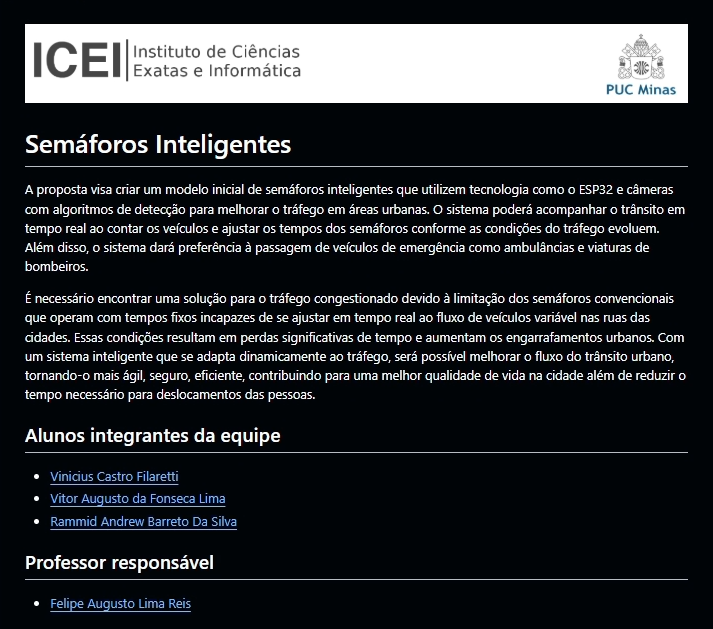

# Semáforos Inteligentes

A proposta visa criar um modelo inicial de semáforos inteligentes que utilizem tecnologia como o ESP32 e câmeras com algoritmos de detecção para melhorar o tráfego em áreas urbanas. O sistema poderá acompanhar o trânsito em tempo real ao contar os veículos e ajustar os tempos dos semáforos conforme as condições do tráfego evoluem. Além disso, o sistema dará preferência à passagem de veículos de emergência como ambulâncias e viaturas de bombeiros.

É necessário encontrar uma solução para o tráfego congestionado devido à limitação dos semáforos convencionais que operam com tempos fixos incapazes de se ajustar em tempo real ao fluxo de veículos variável nas ruas das cidades. Essas condições resultam em perdas significativas de tempo e aumentam os engarrafamentos urbanos. Com um sistema inteligente que se adapta dinamicamente ao tráfego, será possível melhorar o fluxo do trânsito urbano, tornando-o mais ágil, seguro, eficiente, contribuindo para uma melhor qualidade de vida na cidade além de reduzir o tempo necessário para deslocamentos das pessoas.

## Alunos integrantes da equipe

* [Vinicius Castro Filaretti](https://github.com/ViniciusCasF)
* [Vitor Augusto da Fonseca Lima](https://github.com/Vitorlima841)
* [Rammid Andrew Barreto Da Silva](https://github.com/Rammid03)

## Professor responsável

* [Felipe Augusto Lima Reis](https://github.com/falreis)

## Gerenciamento do Projeto

......  COLOQUE AQUI O SEU TEXTO (OPCIONAL) ......

> Adicione aqui informações sobre o projeto que será gerenciado. 
> Indique informações importantes sobre o projeto.

Fases do Gerenciamento do Projeto:
1. [Iniciação](docs/01-iniciacao)
2. [Planejamento](docs/02-planejamento)
3. [Execução](docs/03-execucao)
4. [Monitoramento](docs/04-monitoramento)
5. [Encerramento](docs/05-encerramento)

## Apresentação do Trabalho

......  COLOQUE AQUI O SEU TEXTO ......

> Adicione aqui o vídeo explicativo do trabalho.
> Utilize a estrutura (link) abaixo para apresentação do vídeo.
> O vídeo deve ser postado obrigatoriamente de forma pública no Youtube ou qualquer outra plataforma 

> A imagem abaixo deve ser substituída por uma capa do vídeo de apresentação do trabalho.

## Informações Adicionais

